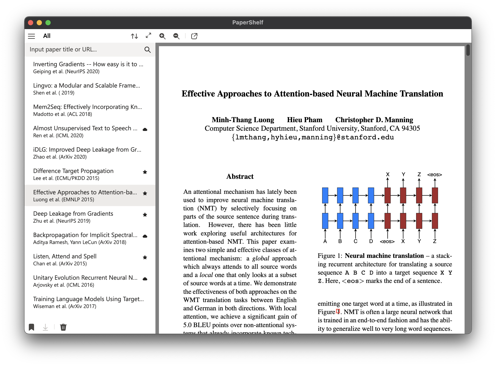

## PaperShelf

PaperShelf is a simple yet elegant tool to search, browse, and organize papers for researchers. It gathers data from publicly available sources (e.g. arxiv) so you always get the official, complete, and up-to-date version and information across different sites.

### Installation

PaperShelf is available in different platforms.

|  | Download |
|----|------|
| Mac OS | [[.dmg]](https://github.com/trungd/PaperShelf/releases/latest/download/PaperShelf-mac.dmg) - [[.zip]](https://github.com/trungd/PaperShelf/releases/latest/download/PaperShelf-mac.zip) |
| Windows | [[.exe]](https://github.com/trungd/PaperShelf/releases/latest/download/PaperShelf-win-Setup.exe) |
| Linux | [[.AppImage]](https://github.com/trungd/PaperShelf/releases/latest/download/PaperShelf-linux.AppImage) (recommended) - [[.deb]](https://github.com/trungd/PaperShelf/releases/latest/download/PaperShelf-linux.deb) |

### Highlight Features

- Search for papers on ArXiv, Semantic Scholar (more sources coming).
- Download papers and index with metadata and auto-generated tags.
- Add papers to your library and organize with *Tags* and *Collections*.
- Render PDF files with readability.

### Preferences

Preferences for the app can be modified by editing `config.yaml`. See [here](./preferences) for details.
