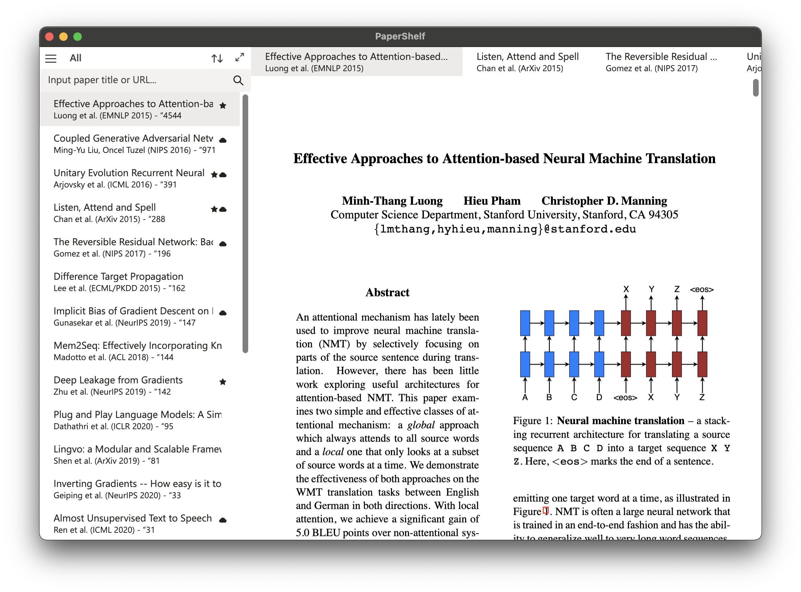

## Why PaperShelf?

As someone doing research, I usually get lost in a bunch of browser tabs or have to manually rename and organize PDF files in my Downloads folder. My bookmarks get messy over time, and sometimes I couldn't recall that paper I came across.

The goal of this project is to build a simple yet elegant tool to search, browse, and organize papers, so that you don't keep a long list of tabs and bookmarks in your browser. PaperShelf gathers data from different publicly available sources, so you always get the official, complete, and up-to-date version and information across different sites.

## Highlight Features

- Search, download, and gather paper information from ArXiv, Semantic Scholar, Google Scholar (experimental), and more sources coming.
- Add papers to your library and organize with Tags and Collections.
- Render PDF files with readability. Crop margin for larger text size. Look up cited papers on mouse click, etc.
